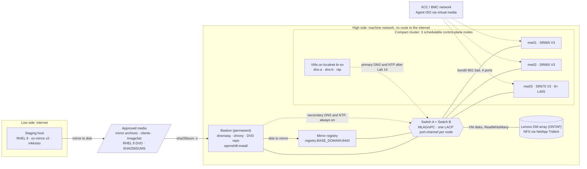

# OpenShift Virtualization In an Air-gapped Environment - Greenfield Deployment

This tutorial walks you through setting up a compact **OpenShift Virtualization** cluster on 3 bare metal nodes in a **disconnected (dark site)** environment. It assumes no prior DNS or NTP server, and no existing Operating System nor network set up on all 3 nodes.

This guide is not for someone looking for a fully automated black-box installer they never read. It is optimized for **learning** so you understand each task required to bootstrap the cluster, the mirror registry, and platform DNS/NTP.

> The results of this tutorial should not be viewed as production ready.
> Always validate against relevant Red Hat documentation and your site standards. 
> Have fun learning!

Scripts under `scripts/` are helpers. Every lab still tells you **where** you are,
**what** to edit (file, key, old value, new value), and **why** the step exists.

## Pre-defined Fields (decide before Lab 01)

The Agent ISO freezes node identity, the VIPs and the registry mirrors at build time, so these
values are fixed — and signed by their owners — before anyone cables a server. Short form for
groups A–C; the full register (groups A–G, with where each value lands and the rule that checks
it) is in [Lab 03 — Site Checklist](docs/labs/03-checklist.md). `.env.example` lists the same keys
in the same order, and every script refuses to run until `scripts/lib/validate-env.sh` passes.

| # | `.env` key | Example | Owner |
|---|---|---|---|
| A1 | `CLUSTER_NAME` | `coe01` | OpenShift lead |
| A2 | `BASE_DOMAIN` | `lab.example.com` | DNS owner |
| A3 | `OCP_VERSION` | `4.22.z` | OpenShift lead |
| A4 | `OCP_CHANNEL` | `stable-4.22` | OpenShift lead |
| B1 | `MACHINE_NETWORK_CIDR` | `10.10.0.0/16` | Network |
| B2 | `NETWORK_GATEWAY` | `10.10.0.1` | Network |
| B3 | `CLUSTER_NETWORK_CIDR`, `SERVICE_NETWORK_CIDR` | `10.128.0.0/14`, `172.30.0.0/16` | Network |
| B4 | `MTU` | `1500` | Network |
| B5 | `API_VIP` | `10.10.0.100` | Network |
| B6 | `INGRESS_VIP` | `10.10.0.101` | Network |
| C1 | `MW01_HOSTNAME` … `MW03_HOSTNAME` | `mw01` | Hardware |
| C2 | `MW01_IP` … `MW03_IP` | `10.10.1.11` | Network |
| C3 | `MW01_NICS` … `MW03_NICS` | `ens1f0=aa:bb:cc:00:01:01,…` (4 pairs) | Hardware |
| C4 | `MW01_ROOT_DEVICE` … `MW03_ROOT_DEVICE` | `/dev/disk/by-path/pci-0000:…` | Hardware |
| C5 | `MW01_BMC_IP` … `MW03_BMC_IP` | `10.20.0.11` | Hardware |
| C6 | `RENDEZVOUS_IP` | `${MW01_IP}` | OpenShift lead |

## Target Audience

Someone who wants to understand how a **greenfield, air-gapped** OpenShift Virtualization deployment fits together: cabling, switches, bastion, mirror registry, Agent-based install, and where DNS/NTP live before and after the cluster exists.

You should be comfortable with a terminal and `vim`, and have a **RHEL 9** staging host with internet access plus BMC (XCC) access to the servers.
You do **not** need prior OpenShift experience.

## Cluster Details

This tutorial guides you through bootstrapping an OpenShift **4.22** cluster on Lenovo hardware, using the **Agent-based Installer** and **oc-mirror v2**.

**Compact Bare Metal Cluster with Network Topology:**



**OpenShift Virtualization Node Roles:**


**There are several ways to configure an OpenShift cluster for different environment demands, but for this particular lab we will be focusing on a compact cluster setup.**


A minimum of 3 nodes is needed by the OpenShift control plane component [etcd](https://docs.redhat.com/en/documentation/openshift_container_platform/4.22/html-single/etcd/index#etcd-overview) to maintain [quorum](https://docs.redhat.com/en/documentation/openshift_container_platform/4.22/html-single/etcd/index#etcd-performance).

### Reference Hardware

| Qty | Model | CPU | Memory | Local disks | Accelerators | NICs 
|---|---|---|---|---|---|---|
| 2 | **ThinkSystem SR665 V3** | 2× AMD EPYC 9334 (32C) | 256 GB | 2× 960 GB SSD | — | 1× 4-port 10GBase-T (OCP slot) + 1× 2-port 10GBase-T (Slot 1) |
| 1 | **ThinkSystem SR675 V3** | 2× AMD EPYC 9334 (32C) | 768 GB | 2× 960 GB SSD | **8× NVIDIA L40S** | 1× 4-port 10GBase-T (OCP slot) + 1× 4-port 10GBase-T (Slot 21) |
| 1 | **ThinkSystem DM** series storage array (model TBC; DG equivalent) | — | — | VM disks over NFS | — | host ports to both switches |

The local SSDs form one RAID1 OS disk per node, so VM disks live on the array. If it turns out to be
a block-only **DS** series, the labs switch to LVMS with one LUN per node (ADR-05).

**Roles for the 3-node compact cluster.** Hostnames read `mw` = **m**aster + **w**orker: each node
runs the control plane (etcd, API server) *and* workloads, so `compute.replicas` is 0.

| Hostname (C1) | Hardware | Role |
|---|---|---|
| `mw01` | SR665 V3 | Master + worker (rendezvous node by default) |
| `mw02` | SR665 V3 | Master + worker |
| `mw03` | SR675 V3 | Master + worker (GPU / heavy VM workloads) |

Plus two helper machines that never share a network (ADR-02): a connected **RHEL 9 staging host**
on the low side for mirroring, and a permanent physical **RHEL 9 bastion** on the machine network for
`openshift-install`, DNS, NTP and the RHEL DVD repository. The mirror registry runs on its own RHEL 9
host or, in a lab, on the bastion.

### Software / Component Versions

| Component | Version / Note |
|---|---|
| OpenShift Container Platform | **4.22** (`stable-4.22`, exact z-stream pinned in `.env` A3) |
| OpenShift Virtualization | `kubevirt-hyperconverged` channel `stable` (from the mirrored catalog) |
| Installer | Agent-based Installer (`openshift-install agent`), compact topology |
| Image mirroring | oc-mirror plugin **v2**: mirror-to-disk → approved media → disk-to-mirror |
| Mirror registry | mirror registry for Red Hat OpenShift, `registry.<BASE_DOMAIN>:8443` |
| Staging host OS | **RHEL 9.x** (low side; Fedora tolerated for learning only) |
| Bastion OS | **RHEL 9.x**, installed from the DVD by kickstart (`mkksiso`) |
| Cluster node OS | RHCOS (installed by the Agent ISO — you do not Kickstart RHCOS by hand) |
| Container runtime | **CRI-O** (OpenShift default; not containerd) |
| Cluster network | **OVN-Kubernetes**; VM network: localnet on `br-ex` via Kubernetes NMState |
| VM storage | `STORAGE_BACKEND`: **ontap** — Lenovo DM/DG via NetApp Trident (NFS, live migration); **hpp** — hostpath provisioner until the array is attached (lab-grade); **lvms** — DS-series LUN per node |
| etcd | Bundled with the OpenShift control plane (not installed manually) |

## Before You Go to the Dark Site

The USB drive is your only supply line, and the Agent ISO is the only artifact on a 24-hour clock,
so you build it on site.

* [USB Transfer Kit](docs/USB-TRANSFER-KIT.md): which Hybrid Cloud Console downloads you need (and which you don't), and what else goes on the drive.
* [Bastion Lifecycle](docs/BASTION-LIFECYCLE.md): USB → bastion as temporary DNS/NTP → install → permanent DNS/NTP with the bastion as secondary → optional bastion retirement, with the two 24-hour windows marked.

## Labs

This tutorial assumes **three** AMD64 Lenovo servers (above), a bastion and a staging host.
Fill the field register in the checklist for your site before Lab 04.

* [Prerequisites and Assumptions](docs/labs/01-prerequisites-assumptions.md)
* [Architecture Overview and Network Design](docs/labs/02-architecture-network-design.md)
* [Site Checklist](docs/labs/03-checklist.md)
* [Setting up the Bastion](docs/labs/04-bastion.md)
* [Provisioning Compute Resources](docs/labs/05-compute-resources.md)
* [Mirroring Images for a Disconnected Install](docs/labs/06-mirroring-images.md)
* [Bootstrapping MVP DNS and NTP](docs/labs/07-mvp-dns-ntp.md)
* [Generating Install and Agent Configuration](docs/labs/08-install-agent-config.md)
* [Certificates, Encryption, and etcd (what OpenShift creates for you)](docs/labs/09-certificates-etcd.md)
* [Bootstrapping the Cluster with the Agent-based Installer](docs/labs/10-bootstrap-cluster.md)
* [Configuring `oc` for Remote Access](docs/labs/11-oc-remote-access.md)
* [Integrating the Mirror Registry and OperatorHub](docs/labs/12-mirror-operatorhub.md)
* [Installing OpenShift Virtualization](docs/labs/13-openshift-virtualization.md)
* [Production DNS and NTP on OCP-V](docs/labs/14-production-dns-ntp.md)
* [Smoke Test](docs/labs/15-smoke-test.md)
* [Cleaning Up](docs/labs/16-cleanup.md)

### Appendices and reference (optional)

* [Architecture decisions (ADR-01 to ADR-08)](docs/DECISIONS.md)
* [Appendix A — Adding workers later](docs/labs/appendix-a-adding-workers.md)
* [Appendix B — Network boot](docs/labs/appendix-b-network-boot.md)
* [Does this repo apply to my customer?](docs/reference/greenfield/appendix-brownfield-contrast.md)
* [Optional KVM practice lab (unsupported)](docs/reference/greenfield/appendix-optional-kvm-lab.md)
* [Diagram placement guide](docs/diagrams/README.md)
* [Greenfield partner reading order (non-normative)](docs/reference/GREENFIELD-README.md)

## Conventions

```text
WHERE:    machine role (.env hostname), OS, user, working directory
WHY:      the outcome, the mechanism behind it, what consumes it, and the symptom if skipped
EDIT:     file → key, from: old value, to: new value (or "No edits in this step.")
DO:       exact commands (use vim, not vi); the only variables are ${ENV_KEYS}
VERIFY:   a command and the literal value to expect
FAILS IF: symptom ← cause
```

One term per concept: **bastion**, **checklist**, **control-plane node** (`master` appears only as an API value).

**Boot methods:** a `mkksiso`-built RHEL 9 DVD (USB or XCC virtual media) for the bastion and
registry host; **XCC virtual media** with the Agent ISO for OpenShift nodes. **Network boot**
(PXE, UEFI HTTP Boot) is out of scope; see [Appendix B](docs/labs/appendix-b-network-boot.md).
