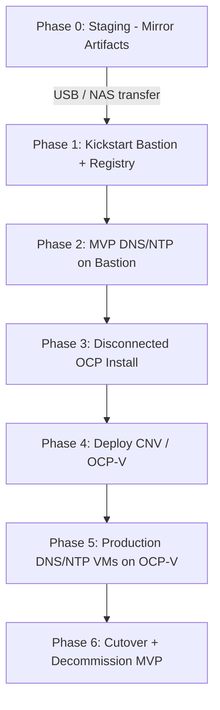

# Architecture Overview

## Dark Site Deployment Phases



## Network Topology (Flat L2)

```
                    ┌─────────────────────────────────────────┐
                    │         Flat L2 Network 10.10.0.0/16    │
                    │         (no VLAN tagging)               │
                    └─────────────────────────────────────────┘
        ┌──────────┬──────────┬──────────┬──────────┬──────────┐
        │          │          │          │          │          │
   ┌────┴───┐ ┌───┴────┐ ┌───┴────┐ ┌───┴────┐ ┌───┴────┐ ┌───┴────┐
   │Gateway │ │Bastion │ │Registry│ │ CP x3  │ │ WK x2  │ │ DNS/NTP│
   │.0.1    │ │.0.5    │ │.0.10   │ │.1.11+  │ │.2.21+  │ │VM .50+ │
   └────────┘ └────────┘ └────────┘ └────────┘ └────────┘ └────────┘
```

## Component Roles

| Component | Phase | Role |
|---|---|---|
| **Staging machine** | 0 | Download OCP release, operator catalogs, RHCOS images |
| **Bastion host** | 1–3 | Installer workstation, MVP DNS/NTP, `/etc/hosts` authority |
| **Mirror registry** | 1–∞ | Local container registry serving OCP + CNV images |
| **Control plane nodes** | 3 | OpenShift masters (etcd, API server) |
| **Worker nodes** | 3–4 | Compute for workloads and VMs (CNV requires bare-metal or nested virt) |
| **DNS VM** | 5 | Authoritative DNS for `ocp-v.local` zone |
| **NTP VM** | 5 | Stratum-3 NTP server for the cluster |

## DNS/NTP Bootstrap Problem

In a dark site with **no existing DNS or NTP**, OpenShift cannot install because:

- Nodes need to resolve `api.<cluster>.<domain>` and `*.apps.<cluster>.<domain>`
- etcd requires time sync within 500 ms across members
- The installer pulls images from the mirror registry by hostname

**Solution (two-stage):**

1. **MVP (Phase 2):** Run `dnsmasq` + `chronyd` on the bastion. All nodes point to the bastion IP for DNS and NTP. Use static `/etc/hosts` entries on every host.
2. **Production (Phase 5):** Deploy BIND9 and chrony VMs on OCP-V. Update node DNS/NTP to point to the VMs. Decommission bastion services.

## Installer Choice

This repo supports **agent-based installation** (recommended for dark sites):

| Method | Pros | Cons |
|---|---|---|
| **Agent-based** | No bootstrap VM; works well disconnected; ISO boots each node | Requires per-node ISO |
| **IPI (installer-provisioned)** | Automated provisioning | Needs DHCP/PXE or vCenter; harder in pure dark site |
| **UPI (user-provisioned)** | Maximum control | Manual node prep |

The scripts default to **agent-based** with a local mirror registry.

## Storage Considerations for OCP-V

OpenShift Virtualization requires:

- **Containerized Data Importer (CDI)** for VM disk images
- **Storage class** with `ReadWriteMany` or `ReadWriteOnce` depending on live migration needs
- Worker nodes with **hardware virtualization** enabled (Intel VT-x / AMD-V)

For the MVP, use **local storage** or **NFS** (if a NAS is available). Production should use a supported CSI driver.

## Security Notes

- Mirror registry uses **self-signed TLS** in dark site; trust the CA on every node
- Pull secret is stored only on the bastion; never commit it to git
- MVP dnsmasq should be firewalled to the cluster subnet only
- Rotate credentials after cutover to production services

## Next Steps

→ [Network Design](02-network-design.md)
