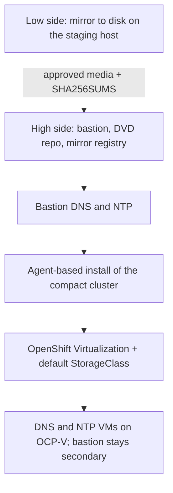

# Architecture Overview

> **Non-normative reference (ADR-01).** Background kept from v1. The normative path is
> [the labs](../labs/README.md); where this page and a lab disagree, the lab wins.

## Deployment phases

## Component roles

| Component | Labs | Role |
|---|---|---|
| Staging host (low side) | 01, 04, 06 | Downloads clients, mirrors to disk, builds the kickstart ISOs; never joins the machine network |
| Bastion (high side) | 04 onward | Runs `openshift-install`; serves DNS, NTP and the RHEL DVD repo for the life of the site |
| Mirror registry | 06 onward | mirror registry for Red Hat OpenShift on port 8443 (may share the bastion) |
| Control-plane nodes `cp01`–`cp03` | 05, 10 | Compact cluster: etcd, API server and workloads on the same three nodes |
| DNS VMs `dns-a`, `dns-b` | 14 | Authoritative BIND for `BASE_DOMAIN`, anti-affine |
| NTP VM `ntp` | 14 | chrony, following `TIME_SOURCE` |

## The DNS/NTP bootstrap problem

In a dark site with no DNS or NTP, OpenShift cannot install: nodes must resolve
`api.<cluster>.<domain>`, `*.apps.<cluster>.<domain>` and the registry, and etcd needs agreed time.

1. **Install phase:** dnsmasq and chronyd on the bastion (Lab 07).
2. **Steady state:** two DNS VMs and one NTP VM on OpenShift Virtualization (Lab 14), with the
   bastion kept as the **secondary** source permanently, because a cold start needs DNS and time
   before those VMs can start (ADR-07).

## Installer choice (OpenShift 4.22)

| Component | Red Hat preference | This repo |
|---|---|---|
| Mirroring | oc-mirror plugin v2 | `scripts/01`, `scripts/04` |
| Installation | Agent-based Installer | `scripts/05a`, `scripts/05b` |
| Cluster mirror config | IDMS / ITMS (not ICSP) | `imageDigestSources` at install; cluster-resources in Lab 12 |
| Registry | mirror registry for Red Hat OpenShift | `scripts/04 install-registry` |

The Agent-based Installer needs no load balancer, bootstrap VM or DHCP on bare metal.

## Storage for OpenShift Virtualization

VM disks are DataVolumes and need a default StorageClass. The reference rack's two SSDs per node
form the RAID1 OS disk, so v2.0 uses the hostpath provisioner on that disk (node-local,
ReadWriteOnce, no live migration — lab-grade) and documents LVMS for when data drives are added
(ADR-05). Production uses a supported CSI driver.

## Security notes

- The mirror registry's own CA is trusted on the bastion and embedded as `additionalTrustBundle`;
  no command in the labs uses `-k`.
- The pull secret and `kubeconfig` live outside the git working tree (ADR-08).
- Passwords are prompted, never stored in `.env`.
